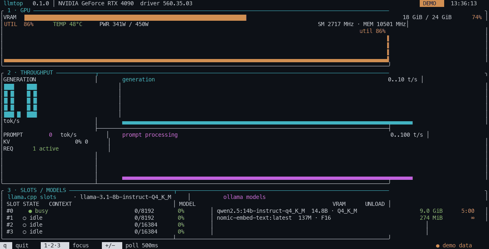

# llmtop

**nvtop for local LLM inference.** A terminal UI that shows what your GPU and
your local inference servers — llama.cpp and Ollama — are doing, live, in one
screen.



*(recorded from `llmtop --demo` — no GPU or server required)*

## What it shows

- **GPU (NVML)** — VRAM gauge, utilization graph over time, temperature,
  power draw vs. limit, SM/memory clocks. Multi-GPU supported.
- **Throughput (llama.cpp)** — big live tokens/s number, separate scrolling
  graphs for generation and prompt processing, KV-cache usage, active/queued
  requests. Rates are computed live from per-slot token counters (`/slots`),
  so the graph moves *while* a request streams — not only when it completes
  (the `/metrics` counters, used as fallback, only flush per request).
- **Slots & models** — the loaded llama.cpp model and every slot with its
  state and a context-fill mini-gauge, plus each Ollama-resident model with
  its VRAM footprint and time until unload.
- Color thresholds (green/yellow/red) for VRAM, temperature, and context
  fill; everything updates at ~10 FPS.

Every data source degrades gracefully: no NVIDIA driver, server not running,
timeouts, malformed responses — the panel says "offline" and llmtop keeps
running.

## Build

Requires CMake ≥ 3.24 and a C++20 compiler. All dependencies (FTXUI, cpr,
nlohmann/json) are fetched automatically via `FetchContent` — no vcpkg/Conan.

```sh
cmake -S . -B build
cmake --build build -j
./build/llmtop
```

NVML (`libnvidia-ml.so`) is loaded at runtime with `dlopen`, so the same
binary works on machines without an NVIDIA driver — you just get a "no GPU"
panel. Linux is the primary target; the code is portable C++20 and also
builds/runs on macOS (without GPU telemetry).

## Usage

```
llmtop [options]

  --llamacpp-url <url>  llama.cpp server base URL (default http://127.0.0.1:8080)
  --ollama-url <url>    Ollama base URL            (default http://127.0.0.1:11434)
  --no-nvml             disable GPU telemetry
  --demo                run with a fake data generator (no GPU/servers needed)
  --interval <ms>       poll interval, 100..5000 (default 500)
  --version / --help
```

| Key | Action |
| --- | ------ |
| `q` | quit |
| `1` `2` `3` | focus a panel |
| `+` / `-` | change poll interval by 100 ms |

### llama.cpp setup

Start `llama-server` with the monitoring endpoints enabled:

```sh
llama-server -m model.gguf --slots --metrics
```

Without `--slots`/`--metrics` llmtop still runs and tells you which flag is
missing. Ollama needs no configuration — `/api/ps` is always available.

### Demo mode

`llmtop --demo` runs a built-in simulator (requests arriving on four slots,
prompt-processing bursts, generation ramps, VRAM/thermals following along) —
useful for trying the UI or recording GIFs without any inference server. The
generator is just another data source behind the same `Source` interface.

## Architecture

```
src/
  main.cpp              CLI parsing, thread lifecycle
  state.hpp             AppState snapshot shared by all threads (mutex + ring buffers)
  sources/              one poller thread per data source
    nvml_source.*       GPU telemetry, NVML loaded via dlopen/dlsym
    llamacpp_source.*   GET /slots + GET /metrics (hand-rolled Prometheus text parser)
    ollama_source.*     GET /api/ps
    demo_source.*       fake data generator (--demo)
  ui/                   FTXUI panels; render thread reads consistent snapshots
```

Poller threads write into `AppState` under a mutex (time series in ring
buffers of 600 samples — 5 minutes at the default interval); the UI thread
copies a snapshot once per frame and never blocks on I/O. HTTP requests use
500 ms timeouts.

## Roadmap

- vLLM support (`/metrics` is already Prometheus-shaped)
- per-process VRAM attribution (which server owns which buffers)
- request latency percentiles
